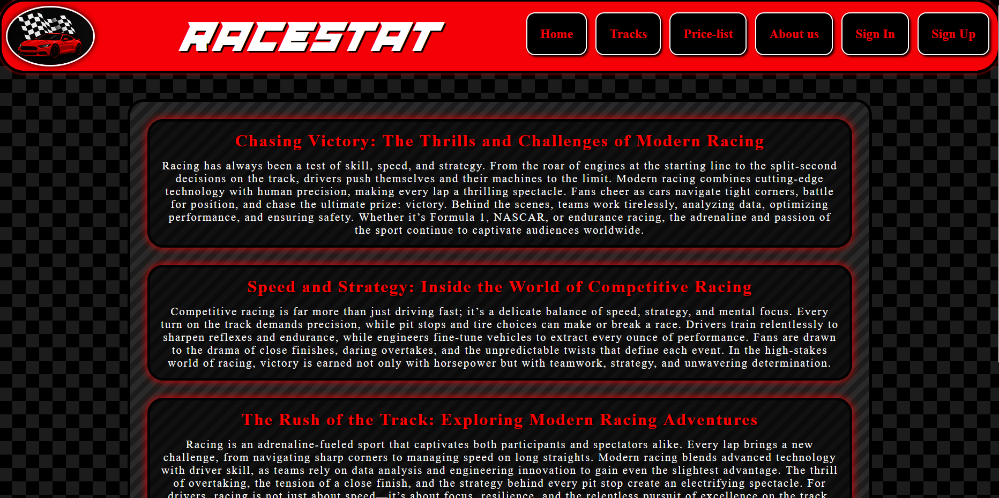
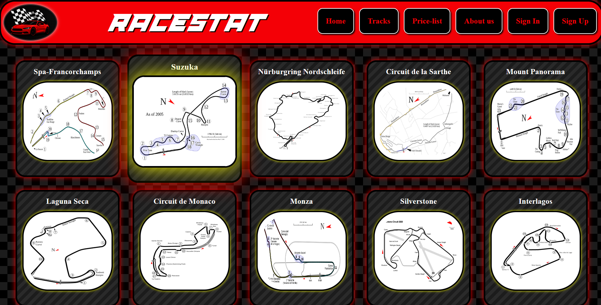
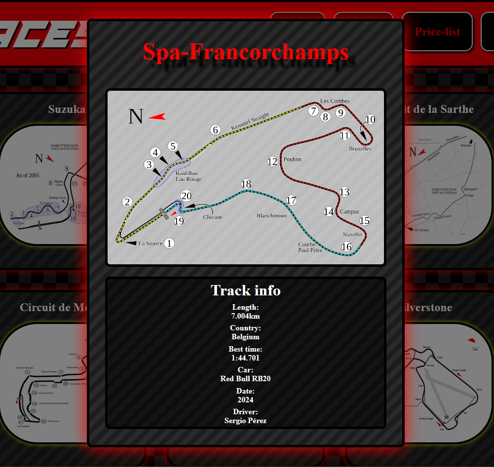
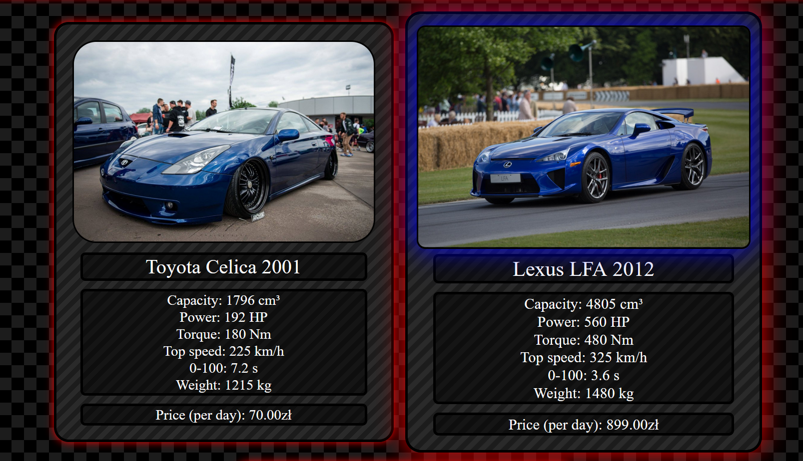
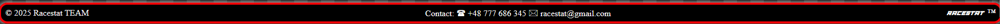

# RaceStat

The website was created as a platform for motorsport and automotive enthusiasts. It provides access to race stories, tracks with detailed information, and a price list of available cars including their specifications and daily rental costs.

## Screens
### Home Page


### Track Page


### Track Details


### Price-list Page


### Footer


### Login and register
 


## Technologies
1. Backend:
 - Python
 - Django
 - Django REST Framework
2. Frontend:
 - React
 - HTML5 / CSS3
 - JavaScript(ES6+)
3. Database:
 - PostgreSQL

## Installation
1. Clone the repository:
```bash
  git clone https://github.com/bb305496/RaceStat
```

2. Backend (Django):
```bash
    cd \backend\racestatbackend
    python -m venv venv
    source venv/bin/activate   # Linux/Mac
    venv\Scripts\activate      # Windows
    pip install -r requirements.txt
    python manage.py migrate
    python manage.py runserver
```
works by default
http://127.0.0.1:8000/

3. Frontend (React):
```bash
    cd frontend
    npm install
    npm start
```
works by default
http://localhost:3000/

## Project Structure
```angular2html
RaceStat/
│── backend/         # Django backend
│   ├── data/        # Database csv files
│   └── racestatbackend/
│
│── frontend/        # React frontend
│   ├── package.json
│   ├── node_modules/
│   ├── public/
│   └── src/
│       ├── CSS/
│       ├── Fonts/
│       ├── Image/
│       ├── Palette/
│       └── *.jsx    # JSX files
│
└── README.md
```

## API Endpoints
| Method | Endopint    | Description                        |
|--------|-------------|------------------------------------|
| GET    | /pricelist/ | get cars info                      |
| POST   | /add_car/   | add car to database                |
| GET    | /tracks/    | get tracks infro                   |
| POST   | /add_track/ | add track to database              |
| GET    | /homepage/  | get content and title from article |
| POST   | /register/  | register endpoint                  |
| POST   | /login/     | login endpoint                     |
| GET    | /users/     | get all usernames                  |

